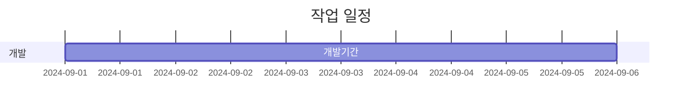

## 📸 Camera Filter App with OpenCV and MediaPipe

  - Python, OpenCV, MediaPipe를 활용하여 실시간 카메라 필터를 구현하고, 필터를 적용한 이미지를 로컬에 저장하는 시스템.


<br><br>

## 📁 프로젝트 간략 소개

- 다양한 실시간 필터를 카메라 피드에 적용하고, 타임스탬프 기반 파일 이름으로 이미지를 저장 가능.
- 사용자 정의 필터를 쉽게 추가할 수 있는 구조 제공.

## 💻 프로젝트 내용

### 🎯 목적
- 실시간 카메라 필터 적용 및 이미지 저장 기능을 통해 사용자 경험 향상.

### 🎣 목표
- a. 다양한 필터를 실시간 카메라 피드에 적용.
- b. 필터가 적용된 이미지를 캡처하여 저장.
- c. 새로운 필터를 쉽게 추가할 수 있도록 구조화된 코드 제공.

## 🗂️ 파일 구성

```
project-folder/
├── ex.py               # 예제 스크립트 1
├── ex1.py              # 예제 스크립트 2
├── filters.py          # 필터 구현 파일
├── sendver.py          # 추가 스크립트
├── config/             # 설정 파일
├── output/             # 저장된 이미지 출력
├── rsrc/               # 리소스 파일
└── README.md           # 프로젝트 문서화
```

## 🛠️ 기술 스택

### **소프트웨어**
- **Python**
- **OpenCV**: 실시간 이미지 처리
- **MediaPipe**: 얼굴 검출 및 랜드마크

## 📊 시스템 구성도

- **시스템 구성**


<br><br>

## 🗓 일정


### 👇 Let's Connect

[](https://github.com/Kwonsiwoo2)  [](https://www.linkedin.com/in/%EC%8B%9C%EC%9A%B0-%EA%B6%8C-064765341/)

