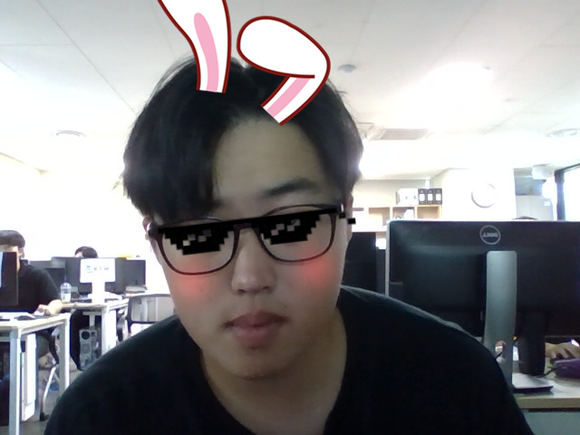
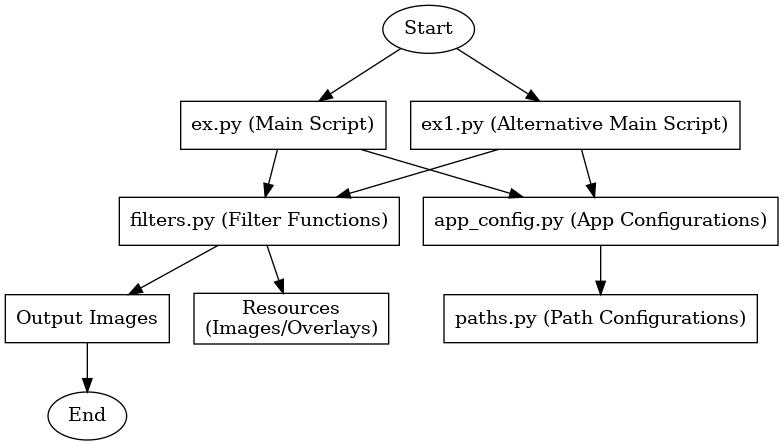

## 📸 Camera Filter App with OpenCV and MediaPipe

This project uses **Python**, **OpenCV**, and **MediaPipe** to implement a variety of real-time camera filters. It also features functionality to save filtered images locally with timestamp-based filenames.

---

### 🔄 Features

1. **Real-Time Filters**: 
   - Apply various filters to your live camera feed in real-time.
   - Filters include:
     - Face landmarks overlay
     - Blur effects
     - Cartoon effects
     - Edge detection

2. **Image Capture with Timestamp**:
   - Capture and save images with the applied filter.
   - Images are saved with filenames based on the current timestamp.

3. **Easy to Extend**:
   - Easily add or modify filters in the `filters.py` file.

---

## 🖼️ Project Images

### Real-Time Monitoring Display

  

---

## 📊 System Architecture Diagram

### Diagram Overview



---

### 🛠️ Technologies Used

- **Python**
- **OpenCV**: For real-time image processing
- **MediaPipe**: For face detection and landmarks

---

### 📖 Installation

1. **Clone the Repository**:
   ```bash
   git clone https://github.com/Kwonsiwoo2/camera_filter_app.git
   cd camera_filter_app
   ```

2. **Install Dependencies**:
   ```bash
   pip install opencv-python mediapipe
   ```

---

### 📚 Project Structure

```
project-folder/
|
├── ex.py               # Example script 1
├── ex1.py              # Example script 2
├── filters.py          # Filter implementations
├── sendver.py          # Additional script
├── config/             # Configuration files
├── output/             # Saved image outputs
├── rsrc/               # Resource files
└── README.md           # Project documentation
```

---

### 📖 Usage

Run the Python script:

```bash
python ex.py
```

**Controls**:
- Press `C` to capture and save an image.
- Press `Q` to quit the application.

Saved images will be stored in the `output` directory with filenames based on the current timestamp (e.g., `capture_20240613_153045.jpg`).

---

### 📝 Example Code

Here’s an example of how to apply a filter in `filters.py`:

```python
import cv2
import mediapipe as mp

def apply_blur(frame):
    return cv2.GaussianBlur(frame, (15, 15), 0)
```

---

### 💡 Tips for Extending

- Add new filters by defining functions in `filters.py`.
- Import your custom filters in `ex.py` or `ex1.py` and apply them to the live camera feed.

---

### 🌟 Contributing

Contributions are welcome! Feel free to submit issues or pull requests.

---

### 👇 Let's Connect!

[](https://github.com/Kwonsiwoo2)  [](https://www.linkedin.com/in/%EC%8B%9C%EC%9A%B0-%EA%B6%8C-064765341/)

